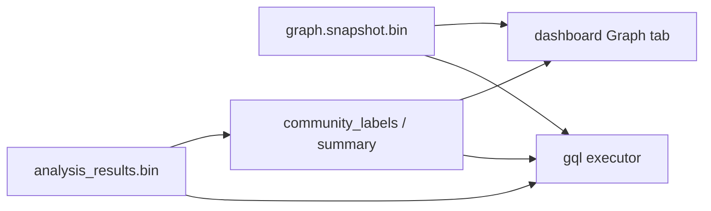

# Community query & naming — Implementation plan

**Goal:** Make label-propagation communities **queryable** and **human-named** (Graphify-style sidebar UX) without writing community labels or membership edges into the topology graph.

**Non-goals (this plan):** Leiden algorithm; stamping `community_id` / `MEMBER_OF` into `graph.snapshot.bin`; requiring an LLM for v1.

**Related:** [graph-metrics-design.md](graph-metrics-design.md) (community detection naming), [gql-design.md](gql-design.md), [semantic-search-design.md](semantic-search-design.md), [analysis-architecture.md](../analysis-architecture.md).

---

## 1. Why this shape

| Concern | Choice |
|---------|--------|
| Code graph = facts | Topology stays CALLS/USES/… only |
| Communities = derived partition | Live in `analysis_results.bin` + dashboard JSON |
| Naming = metadata on the partition | `community_id → label` sidecar / summary rows |
| Semantic / embedding community ID | Later: pool member embeddings; still not topology |

UX target (Graphify hero): colored clusters + sidebar of **named** communities with sizes — not `Community 450`.



---

## 2. Phased delivery

| Phase | Outcome | User-visible |
|-------|---------|--------------|
| **P0** | Wire existing heuristic labels into export | Dashboard shows real names, not `Community N` |
| **P1** | Virtual `community_id` + `:Community` in GQL | Agents/CLI can list and filter communities |
| **P2** | Macros + docs/recipes | One-liner discoverability |
| **P3** | Optional embedding-assisted / LLM naming | Graphify-quality thematic labels |
| **P4** | Community semantic search (optional) | “Find communities like checkout” |

Ship P0→P2 before investing in LLM naming.

---

## 3. Phase 0 — Named communities in the dashboard (quick UX win)

### Problem
`detect_communities` / `build_dashboard_community` already infer labels (path prefix, token frequency, `"Infrastructure / Common Library"`), but `rbuilder_dashboard::communities::summarize_communities` hardcodes `format!("Community {cid}")`.

### Steps

1. **Single label builder** — Extract shared API in `rbuilder-analysis` (or dashboard helper that calls analysis):
   - Input: community id, member node refs (or names + paths), optional infra flag
   - Output: `label: String`
   - Reuse `infer_label_from_names`, path-prefix logic from `community.rs`
2. **Persist labels with analysis (preferred)** — Extend community sidecar so discover does not recompute labels only at dashboard time:
   - Option A (minimal): add `CommunityLabelTable { labels: Vec<(usize, String)> }` or `HashMap<usize, String>` next to `CommunityTable` in `AnalysisResults`
   - Option B (lighter): compute labels only during dashboard export from graph + assignments (no schema bump) — acceptable for P0 if discover already hydrates for `--with-dashboard`
3. **Fix export** — In `crates/rbuilder-dashboard/src/communities.rs`, set `CommunitySummary.label` from the label builder / analysis, not `Community {id}`.
4. **UI check** — Graph tab community legend / filters show the new strings; colors unchanged (`community_color_hex`).
5. **Tests** — Unit test: two clusters with `login`/`logout` vs `get_user`/`list_users` → distinct non-placeholder labels; infra hub → `"Infrastructure / Common Library"`.
6. **Docs** — Note in [dashboard-user-guide.md](../dashboard-user-guide.md) that community names are heuristic.

### Acceptance
- After `discover … --with-dashboard`, `.rbuilder/dashboard/communities.json` has meaningful `label` values for ≥ majority of communities with size ≥ 2 on ecommerce-java (or fixture).
- Fallback remains `Community {id}` when inference is weak.

---

## 4. Phase 1 — GQL: virtual community surface

### Design rules
- Do **not** mutate `graph.snapshot.bin`.
- `gql` loads topology + `analysis_results.bin` (graceful degrade if analysis missing: property absent / empty `:Community`).
- `community_id` is a **virtual property** resolved via UUID → compact id → `CommunityTable::assignments`.

### Steps

1. **Analysis context for GQL**
   - Add optional `CommunityQueryContext` (assignments + id→label + member counts) built from `AnalysisResults` (+ labels from P0).
   - Thread into executor from `src/cli/gql.rs` and HTTP `/api/query` (same path as `serve`).
2. **Property resolution**
   - In property match / WHERE evaluation, when key is `community_id`, resolve from context (stringify id for equality with existing string matchers, or add numeric compare if cheap).
   - Ensure `RETURN` bindings for Function nodes can expose `community_id` in JSON output (extend `gql_result_to_json` / binding serialization).
3. **Virtual node type `:Community`**
   - Register `Community` as a **query-only** label (not in `NodeType` enum of the code graph — avoid polluting schema digest).
   - Executor synthesizes rows from label summary: `id`, `label`, `member_count`, `modularity` (graph-level ok as query attr or omit per-row).
   - Reject unknown real graph types as today; document `Community` as virtual in gql-design.
4. **Optional: membership without edges**
   - Prefer filter form: `MATCH (f:Function) WHERE f.community_id = 12 RETURN f`
   - Defer `MATCH (f)-[:MEMBER_OF]->(c)` unless product insists — that pattern tempts people to think membership is topology.
5. **Tests**
   - Fixture graph + fake `CommunityTable` → filter returns expected functions.
   - `MATCH (c:Community) RETURN c` → count matches `num_communities` (or filtered size ≥ 2 policy — match dashboard).
   - No analysis file → clear empty / warning, not panic.
6. **Perf**
   - Build inverted index `community_id → Vec<Uuid>` once per query session if WHERE filters by id (avoid O(N) full scans repeatedly within one query).
   - Listing communities is O(#communities), tiny.

### Acceptance
```bash
rbuilder -r "$REPO" -f json gql 'MATCH (c:Community) RETURN c'
rbuilder -r "$REPO" -f json gql "MATCH (f:Function) WHERE f.community_id = 12 RETURN f LIMIT 20"
```
Both work after normal `discover` (analysis present). Snapshot size / content digest unchanged when only community labels change.

---

## 5. Phase 2 — Macros, HTTP, agent docs

### Steps

1. **Macros** in `crates/rbuilder-gql/src/macros.rs`:
   - `all_communities` → `MATCH (c:Community) RETURN c`
   - `community_members` — needs a parameter story; if macros are string-only today, document literal form or add `--macro-arg` later. v1: document the WHERE pattern in recipes only if params unsupported.
2. **HTTP** — Confirm `/api/query` uses the same analysis-aware executor; document in [http-api.md](../http-api.md).
3. **Docs**
   - [AGENTS.md](../../AGENTS.md) / [agent-recipes.md](../agent-recipes.md): “list communities”, “members of community”
   - [gql-design.md](gql-design.md): virtual labels section
   - [user-guide.md](../user-guide.md): short community query subsection
4. **CLI help** — `gql --help` or macro list mentions new macros.

### Acceptance
Agent recipe copy-paste works on ecommerce-java; JSON schema_version stable.

---

## 6. Phase 3 — Better naming (Graphify-quality)

Layer on P0 heuristics; keep labels in the community summary sidecar.

| Tier | Method | When |
|------|--------|------|
| **3a Heuristic v2** | Package-majority vote, top PageRank symbol in cluster, strip infra hubs from naming | Default discover |
| **3b Embedding-assisted** | Mean/pool member vectors from `semantic_index.bin`; pick representative token or nearest lexicon phrase | After `semantic index` |
| **3c LLM / agent label** | Opt-in `rbuilder communities label` (or discover flag) with member sample → short title | CI/offline; never required for core |

### Steps (3a first)

1. Improve label builder inputs: package paths from metagraph, centrality from analysis.
2. Deduplicate colliding labels (`auth`, `auth (2)`).
3. Persist labels; dashboard + GQL both read same source.
4. (3b) Optional: write `community_embedding` rows keyed by id; do not block P1.
5. (3c) CLI subcommand mirroring Graphify’s `label` / `--no-label` split — agent can rename; CLI can call a backend later.

### Acceptance
On a mid-size app repo, sidebar names are mostly domain words; placeholders &lt; ~20% of communities with size ≥ 5.

---

## 7. Phase 4 — Community-level semantic search (optional)

Only after P1 + semantic index maturity.

1. Build community vectors (pool function embeddings of members).
2. `semantic query --scope community "shopping cart"` or GQL-adjacent API.
3. Still no topology mutation.

---

## 8. Implementation map (files)

| Area | Likely touch points |
|------|---------------------|
| Label inference | `crates/rbuilder-analysis/src/community.rs` |
| Analysis schema | `crates/rbuilder-analysis/src/results.rs` (+ migrate/version if new columns) |
| Dashboard export | `crates/rbuilder-dashboard/src/communities.rs`, export bundle entry |
| Discover write path | `src/cli/discover_impl.rs` (fill labels when community table written) |
| GQL executor | `crates/rbuilder-gql/src/*` (virtual type, property join) |
| CLI / HTTP | `src/cli/gql.rs`, serve query handler |
| Macros | `crates/rbuilder-gql/src/macros.rs` |
| Docs | `docs/design/gql-design.md`, `AGENTS.md`, `agent-recipes.md`, user-guide |
| Tests | analysis unit tests; gql integration; dashboard harness community label assert |

---

## 9. Suggested work order (checklist)

### P0 — Dashboard names
- [x] Shared `infer_community_label(...)` API
- [x] Wire into `summarize_communities` / export
- [x] Fixture test + manual check on ecommerce-java
- [x] Dashboard user-guide blurb

### P1 — GQL join
- [x] Load `AnalysisResults` in `gql` / `/api/query`
- [x] Virtual `community_id` on Function (WHERE + RETURN)
- [x] Virtual `:Community` listing
- [x] Missing-analysis behavior
- [x] Integration tests

### P2 — Discoverability
- [x] `all_communities` macro
- [x] AGENTS + agent-recipes + http-api + gql-design updates

### P3 — Naming quality
- [x] Heuristic v2 (package / hub-aware)
- [x] Label collision handling
- [x] (Optional) embedding-assisted names — via `--scope community` pooling
- [x] (Optional) `communities label` CLI

### P4 — Community search
- [x] Community embedding index + query flag (`semantic query --scope community`)

---

## 10. Risks & decisions

| Risk | Mitigation |
|------|------------|
| Users expect `MEMBER_OF` edges | Document virtual model; offer WHERE form first |
| Label churn every discover | Accept for heuristics; stable id + mutable label; don’t bust graph digest |
| Analysis/graph skew after partial incremental | If assignments missing, omit property; document “re-run discover” |
| `:Community` vs real `NodeType` | Keep virtual; never write Community nodes to snapshot |
| LLM cost/privacy | P3c opt-in only |

**Decision locked by this plan:** communities stay **outside** the topology graph; naming and query are **overlays**.

---

## 11. Success metrics (UX)

- Users can answer “what are the subsystems?” via dashboard legend **or** one GQL/macro call.
- Names read as domain language more often than `Community N`.
- Discover wall time / snapshot size unchanged for P0–P2 (no second graph rewrite).
- Agents use recipes without opening `communities.json` by hand.
